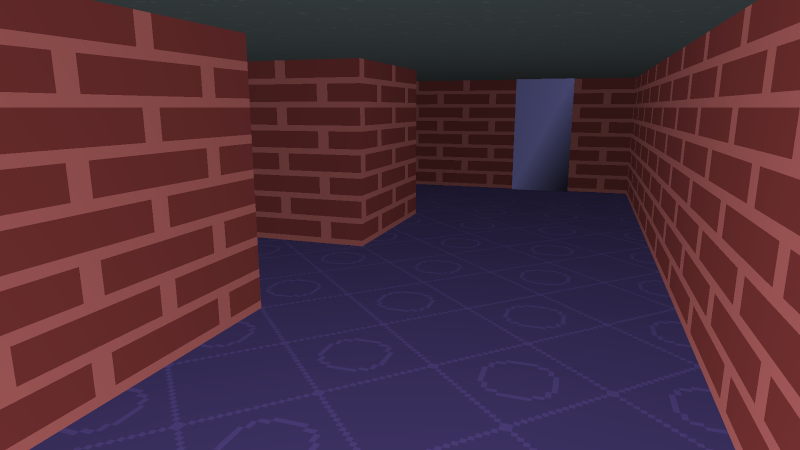
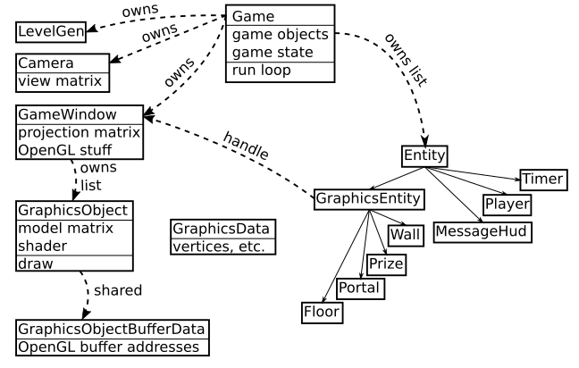

# Chalice Chaser

## Building

Install opengl dependencies on linux:
```
sudo apt-get install libgl1-mesa-dev libglfw3-dev
```

Build project on linux:
```
mkdir build
cd build
cmake ..
make
```

Generate documentation:
```
doxygen doxygen_settings.cfg
```

(you would need to install doxygen and graphviz: `apt-get install doxygen graphviz`)

## Playing

Execute `run.sh`.

| action            | control        |
|-------------------|----------------|
| quit              | esc            |
| move              | WASD           |
| look              | mouse movement |
| restart           | R              |
| toggle fullscreen | F              |

You will spawn in front of a portal in a randomly generated level.
The level has a treasure in it. Find the treasure, and then get back to
the portal before the timer runs out!
The timer starts as soon as you grab the treasure.



## Code

Here is a high level overview of the code:



The "graphics engine" could be thought of as consisting of the four classes in the lower left:
`GraphicsData`, `GameWindow`, `GraphicsObject`, and `GraphicsObjectBufferData`.
